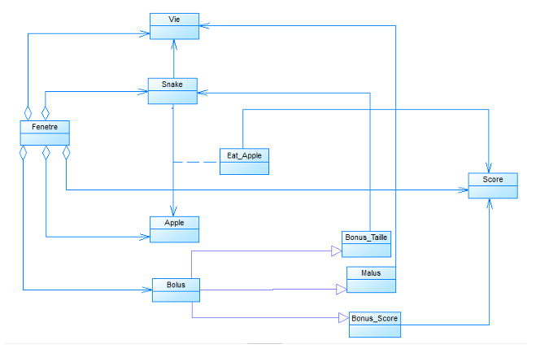
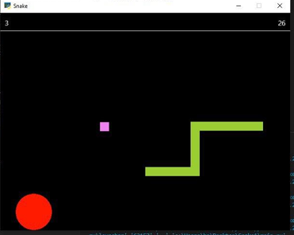
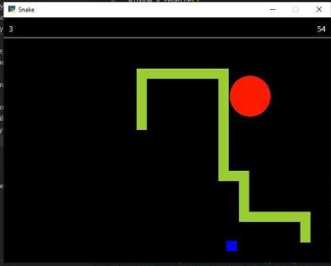
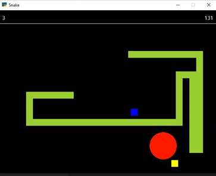

# Snake Game

A Python Snake game built with `pyglet`.

## Description

This project contains a classic Snake game with scoring, life tracking, items, and keyboard control. The game logic and rendering are implemented in the `Snake/` folder.

## Features

- Fixed 640x480 window
- Life counter and score display
- Snake movement and collision detection
- Apple spawn every 5 seconds
- Bonus and malus items
- Pause and resume with `Space`

## Installation

1. Install Python 3.8 or later.
2. Install dependencies:

```bash
pip install pyglet
```

## Run the game

From the project root:

```bash
python Snake/main.py
```

## Project structure

- `Snake/` - game source code
- `Snake/main.py` - game entry point
- `Snake/test_snake.py` - unit tests
- `mockups/` - design and proof images
- `screenshots/` - proof screenshots for the GitHub repository

## Game mockup

The game follows a classic Snake layout:

- Window size: `640x480`
- Top-left: life counter
- Top-right: score counter
- Ceiling line at `y = 440`
- Green snake body made of 20x20 blocks
- Red apple appears at random positions not on the snake
- Bonus and malus items appear at timed intervals
- The snake grows after eating the apple and can change score or length with bonuses/maluses

## Mockups

Design and layout proofs are included in the `mockups/` folder:

- `mockups/class.png`
- `mockups/Bonus_Score.png`
- `mockups/Bonus_Taille.png`
- `mockups/Malus.png`

### Class diagram



### Bonus Score



### Bonus Taille



### Malus



## Development tasks

The project has been structured around the following development tasks:

1. Build the game window and display initial life and score labels.
2. Add a ceiling and create the snake body.
3. Enable snake movement, pause/resume, and input handling.
4. Implement snake head tracking, self-collision, and game-over detection.
5. Add scoring that increases over time while the snake is alive.
6. Add apples that appear every 5 seconds, increase score by 5, and grow the snake.
7. Add life tracking with the `Vie` class.
8. Add bonus and malus items that affect score and snake length or cause death.

## Screenshots

Place gameplay proof images in `screenshots/`.

Suggested file names:

- `gameplay.png`
- `score.png`
- `mockup.png`

These images support the GitHub repository presentation.
